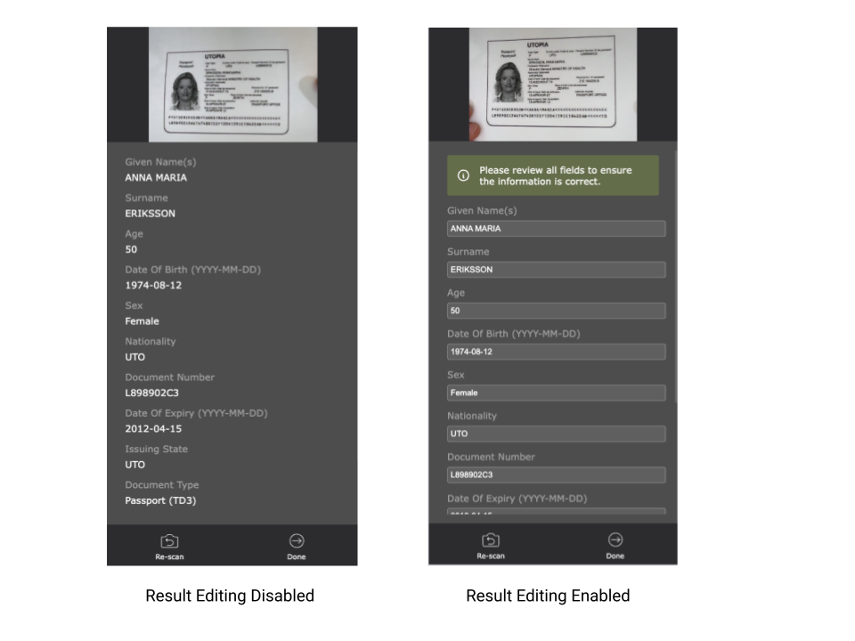

# Customizing the MRZ Scanner JavaScript Edition

>[!NOTE]
>
>Before going into the ways that you can customize the MRZ Scanner, please read the [MRZ Scanner JavaScript Edition User Guide]({{ site.guides }}mrz-scanner-v2.1.html).

## Quick Links

- [Setting Available MRTD formats](#setting-available-mrtd-formats)
- [Hiding the Result View](#hiding-the-result-view)
- [Changing the Scan Guide Frame](#changing-the-scan-guide-frame)
- [Reading Static Images and PDFs using the MRZ Scanner](#reading-static-images-and-pdfs-using-the-mrz-scanner)
- [Configuring the `onDone` Callback](#configuring-the-ondone-callback)
- [Enable Result Editing](#enable-result-editing)

## Introduction

This guide expands on the User Guide that explored the MRZ Scanner Hello World sample project. Here we explore ways to customize the UI as well as the performance of the MRZ Scanner. We will walk through the three main configuration interfaces - [**`MRZScannerConfig`**]({{ site.api }}mrz-scanner-v2.1.html#mrzscannerconfig), [**`MRZScannerViewConfig`**]({{ site.api }}mrz-scanner-v2.1.html#mrzscannerviewconfig), and [**`MRZResultViewConfig`**]({{ site.api }}mrz-scanner-v2.1.html#mrzresultviewconfig). These configuration interfaces make customizing the MRZ Scanner as easy as adding or changing a few properties in the instance constructor. Every sample is a variation on the previous Hello World sample with a few additional properties defined in the configuration interfaces, and so we only show the differing portion rather than all the code.

## `MRZScannerConfig` Overview

The [**`MRZScannerConfig`**]({{ site.api }}mrz-scanner-v2.1.html#mrzscannerconfig) interface is capable of configuring almost all customization options applicable to MRZ scanning use cases with the MRZ Scanner. The MRZ Scanner uses passes an `MRZScannerConfig` object to the constructor when creating an MRZ Scanner instance. `MRZScannerConfig` contains the following properties:

1. **`license`** - the license key is the only property whose ***value must be specified when instantiating the MRZ Scanner instance***. If the license is undefined, invalid, or expired, the MRZ Scanner cannot proceed with scanning, and instead displays a pop-up error message instructing the user to contact the site administrator to resolve this license issue.

2. **`container`** - pass a DOM element to this property to contain the entire MRZ Scanner UI within that DOM element. This property is optional. When not specified, (e.g. in our [Hello World sample]({{ site.codegallery }}helloworld/index.html)) the MRZ Scanner automatically creates its own container upon instantiation and uses that container instead.

3. **`templateFilePath`** - a template file is a JSON file that contains a series of algorithm parameter settings (called Capture Vision templates) that is usually used for very specific and customized scanning and parsing scenarios. The `templateFilePath` points to the location of the JSON file. The MRZ Scanner comes with a default template file, but you may choose to use a custom template to target specialized use cases. We recommend contacting the [Dynamsoft Technical Support Team](https://www.dynamsoft.com/company/contact/) for assistance with template customization. Simply host the custom template file on the hosting server of the web application and use the `templateFilePath` to define its location to the MRZ Scanner.

4. **`utilizedTemplateNames`** - define the names of Capture Vision template(s) defined in the non-default template file pointed to by `templateFilePath`. These names must be declared in this property when using a custom template with `templateFilePath`.

5. **`engineResourcePaths`** - the engine files of the library make up the core of the library and define the operation as well as the UI. `engineResourcePaths` defines the location of the engine files in case they are being referenced from another different location. This property is typically used with frameworks such as **React**, **Angular**, and any other framework that makes use of a package manager like **`npm`** or **`yarn`**.

6. **`scannerViewConfig`** - this is the configuration interface for the `MRZScannerView`, which is responsible for the main scanning functionality as well as the camera UI. We explain the configuration properties nested in this object in the [`MRZScannerViewConfig` overview](#mrzscannerviewconfig-overview).

7. **`resultViewConfig`** - this is the configuration interface for the `MRZResultView`, which is responsible for displaying the scanned MRZ document and its parsed data after a successful scan. You can find the breakdown of the `MRZResultView` settings in the [`MRZResultView` overview](#mrzresultviewconfig-overview).

8. **`mrzFormatType`** - configure the available MRTD formats that the MRZ Scanner can read. The formats set in `mrzFormatType` are the formats that appear in the format selector box within the `MRZScannerView`. By default, the library will include all of the supported MRTD formats.To learn more about the different MRTD formats the library supports, visit the introduction page for [more details]({{ site.introduction }}index.html#supported-mrz-formats).

9. **`showResultView`** (default value `true`) -  toggle the visibility of the `MRZResultView`. If `false`, the MRZ Scanner immediately closes upon a successful scan rather than going into the `MRZResultView`, then proceeds to the next step of the web application's workflow (outside the purview of the MRZ Scanner SDK). In the case of the Hello World sample, the next step just takes the user back to the landing page.

Next, we go over the different ways that these properties can be used to customize the scanner with a few examples.

### Setting Available MRTD formats

> [!TIP]
> Prerequisite: [Introduction to MRZ Formats]({{ site.introduction }}index.html#supported-mrz-formats)

The MRZ Scanner reads all three MRZ formats, but it can optionally restrict the MRZ format that it reads. For example, you may want to configure MRZ scanner to only read **TD1** and passport (**TD3**) document types, while **ignoring TD2** documents. Here is a quick snippet based on the Hello World code (from the [User Guide]({{ site.guides }}mrz-scanner-v2.1.html)) that sets the specific MRZ formats to read using the `mrzFormatType` property:

```ts
const mrzScanner = new Dynamsoft.MRZScanner({
   license: "YOUR_LICENSE_KEY_HERE",
   mrzFormatType: ["passport", "td1"], // setting it to just TD3 (passport) and TD1
});
```

After changing the `mrzFormatType`, the format selector box of the MRZScannerView reflects the two formats selected above instead of all three formats available by default. If you only set a single MRZ format with `mrzFormatType`, the format selector box of the MRZScannerView *does not appear, even if showFormatSelector is set to `true`*.

### Hiding the Result View

You may not want to use the Result View that the MRZ Scanner provides. If your workflow does not require the user to view or verify the scanned results, you may opt to forego the Result View after the SDK finishes a scan, then exit the MRZ Scanner portion of your application workflow. Here is how to configure the MRZScanner to hide the result view:

```ts
const mrzScanner = new Dynamsoft.MRZScanner({
   license: "YOUR_LICENSE_KEY_HERE",
   showResultView: false,
});
```

## `MRZScannerViewConfig` Overview

[**`MRZScannerViewConfig`**]({{ site.api }}mrz-scanner-v2.1.html#mrzscannerviewconfig) controls the UI elements of the `**MRZScannerView**`, which is the view responsible for scanning operations. Here are its properties in detail:

1. **`cameraEnhancerUIPath`** - define the path to a custom HTML user interface file for the `MRZScannerView`, which is based on the UI for the Dynamsoft Camera Enhancer SDK used by the MRZ Scanner. Setting the path to a custom file allows this custom UI to take effect for any `MRZScanner` instance created within your application. We recommend you to reach out to the [Dynamsoft Technical Support Team](https://www.dynamsoft.com/company/contact/) to assist you in creating such a custom UI.

2. **`container`** - assign a specific DOM element to contain the `MRZScannerView` in. By default, when not specified, the MRZScanner creates its own container for this View automatically.

3. **`showScanGuide`** (default value `true`) - toggle the availability of the *scan guide*. Other than the actual camera view, one of the main elements in the `MRZScannerView` is a *scan guide frame*. When enabled, placing the MRZ document within the boundaries of the scan guide frame allows the library to quickly and accurately recognize the MRZ and decipher it. When enabled, the MRZ Scanner does not read outside the confines of the scan guide, so enabling the scan guide reduces the need to read the entire camera frame. There are three frames, one for each MRTD format. Going from left to right, the first scan guide corresponds to the TD3 (Passport) format, the second is the TD2 (ID) format, and the third is the TD1 (ID) format. Read more about how the detection region changes with different combinations of enabled MRTD formats [here](#changing-the-scan-guide-frame).

    <div align="center">
       
    </div>

4. **`showUploadImage`** (default value `true`) - in addition to scanning via a camera, the MRZ Scanner can also read MRZs from image files from the device's local storage from the file import icon in the `MRZScannerView` UI header. You can disable this feature (and the icon) by setting this property to `false`.

5. **`showFormatSelector`** (default value `true`) - toggle the selector box near the bottom of the `MRZScannerView` that allows the user to toggle recognition of individual MRZ formats. The selectable formats in this selector box are defined by the **`mrzFormatType`** property. The user cannot disable reading all formats - at least one will be enabled. The scan guide frame (if shown) will also change based on which format(s) are selected. (see [changing the scan guide frame](#changing-the-scan-guide-frame) for more details) Setting this property to false disables the format selector.

    <div align="center">
       
    </div>

6. **`showSoundToggle`** (default value `true`) - the MRZ Scanner can play a beeping sound upon successfully recognizing an MRZ. This feature depends on browser support. When this property is `true`, the sound toggle icon appears at the top of the MRZScannerView in a grey disabled state. To hide this feature altogether, set this property to `false`.

7. **`showPoweredByDynamsoft`** (default value `true`) - the scanner UI includes a "Powered By Dynamsoft" message that shows at the bottom. This property allows you to hide this text if you wish.

8. **`enableMultiFrameCrossFilter`** (default value `true`) - enable the multi-frame result cross filter to improve read accuracy at the cost of a slight increase to MRZ read time.

9. **`uploadAcceptedTypes`** (default value `"image/*"`) - allows the user to configure which image and file format(s) the library will accept if the user chooses to decode static images instead of using the camera view to scan MRZs.

10. **`uploadFileConverter`** - this function converts non-image files (e.g. PDF) to blobs so that they can be read by the MRZ Scanner. It is essential that this function is used if you would like to support reading PDF files in your web app.

> [!NOTE]
>
> Not every UI element of the MRZScannerView can be controlled by the MRZScannerViewConfig. Namely, the **torch/flash button** will always show up in the **MRZScannerView**.

### Using the MRZScannerViewConfig

Now that we have gone through all the properties that make up the MRZScannerViewConfig, let's see them in action:

```ts
const mrzScanner = new Dynamsoft.MRZScanner({
   license: "YOUR_LICENSE_KEY_HERE",
   scannerViewConfig: {
      showScanGuide: false, // hides the scan guide frame; true by default
      showUploadImage: false, // hides the load image icon that shows up in the toolbar at the top of the view; true by default
      showFormatSelector: false, // hides the format selector box if more than two MRZ types are assigned; true by default
      showSoundToggle: false, // hides the sound icon that allows the user to control whether a beep is played once an MRZ is recognized; true by default
      showPoweredByDynamsoft: false, // hides the "Powered By Dynamsoft" message that appears on the scanner UI; true by default
      enableMultiFrameCrossFilter: false, // turning the filter off could improve the speed but at the cost of result accuracy; true by default

      uploadAcceptedTypes: "image/*,application/pdf", // allows the user to upload static images and PDFs to be read by the MRZ Scanner - default is "image/*"
      uploadFileConverter: async (file) => {
         if (file.type === "application/pdf") {
            // Example PDF to image conversion
            const pdfData = await convertPDFToImage(file);
            return pdfData;
         }
        // For other non-image types, you can add more conversion logic
        // If it's not a supported type, throw an error
        throw new Error("Unsupported file type");
      },
   }
});
```

### Changing the Scan Guide Frame

The `MRZScannerView` provides a guide frame for each of the three MRTD formats. Because the MRZ Scanner only scans within the guide frame (when the guide frame is enabled), here we explain which guide frame is used when multiple MRTD formats are selected in the format selector:

1. If **passport** is selected, then the guide frame for passport (TD3) will be displayed.

2. Otherwise, if both **ID (TD1)** and **ID (TD2)** are selected or only **ID (TD1)**, (but not passport), then the frame for ID (**TD1**) will be displayed.

3. The ID (TD2) guide frame only gets displayed if **ID (TD2)** is the only selected format.

Please contact the [Dynamsoft Support Team](https://www.dynamsoft.com/company/contact/) for any further inquiries, or to customize the frame guide selection logic.

### Reading Static Images and PDFs using the MRZ Scanner

Starting from **v2.1** of the MRZ Scanner, the library is now able to read MRZs **directly** from static images and PDFs. To support this, the MRZScannerViewConfig will need to be configured to support that, especially for PDFs.

To learn more on how to create a web application that supports static image/PDF reading using the MRZ Scanner, please refer to this [guide]({{ site.guides }}mrz-scanner-static-image.html). Furthermore, please refer to the full File Input Sample that the previously linked guide walks you through.

## `MRZResultViewConfig` Overview

The **`MRZResultView`** user interface displays the parsed MRZ results as well as the cropped image of the MRTD document to save the time and resources needed to build your own viewer. The [**`MRZResultViewConfig`**]({{ site.api }}mrz-scanner-v2.1.html#mrzresultviewconfig) contains the following settings used to customize this View:

1. **`container`** - assign a specific DOM element to contain the `**MRZResultView**` in. By default, when not specified, the MRZScanner creates its own container for this View automatically.

2. **`toolbarButtonsConfig`** - configure the `MRZResultView` toolbar located in the footer in portrait mode, and on the right hand side of the screen in landscape. The **re-take button** takes the user back to the `MRZScannerView` to scan a new MRZ, discarding the previously scanned result. The other button is a **done button** that closes the scanner and destroys the `MRZScanner` instance. We explain how to use the `toolbarButtonsConfig` to customize this tool bar. The **cancel button** appears in place of the re-take button when the MRZ Scanner is launched with a static file instead of the standard camera UI.

3. **`showOriginalImage`** (default value `true`) - show or hide the cropped image of the scanned MRZ document at the top of the View. Set this property to `false` to hide the image.

4. **`showMRZText`** (default value `true`) - show or hide the raw MRZ text as one of the result fields in the result view. By default, this txt will be shown but if you would like to hide it, then setting this property to `false` will do the trick.

5. **`allowResultEditing`** (default value `false`) - control whether or not the parsed text fields can be edited by the user. In certain cases, the MRZ text result parsed by the SDK may not exactly match the text present on the MRZ document. You may choose to allow the user to edit the result fields after cross-checking them with the info present on the document itself by displaying the original document with `showOriginalImage: true`.

6. **`onDone`** - set a callback function to be executed upon exiting the MRZ Scanner workflow when the user clicks the *Done* button. This callback receives the MRZResult object representing the full MRZ result (including the scanned image and the parsed MRZ string) for further processing after closing the MRZ Scanner and entering the next stage of your application's workflow. Read more about implementing `onDone` in the [following section](#configuring-the-ondone-callback).

### Using the `MRZResultViewConfig`

Now that we have learned about the properties of the [**`MRZResultViewConfig`**]({{ site.api }}mrz-scanner-v2.1.html#mrzresultviewconfig) interface, let's now demonstrate how to use it in a simple code snippet:

```ts
const mrzScanner = new Dynamsoft.MRZScanner({
   license: "YOUR_LICENSE_KEY_HERE",
   scannerViewConfig: {
      /* see the MRZScannerViewConfig section for details*/
   },
   resultViewConfig: {
      showOriginalImage: false, // hides the cropped image of the MRZ document in the result view; true by default
      allowResultEditing: true, // enables the ability to edit the result fields should the parsed information not match the MRZ document; false by default
      showMRZText: false, // hides the raw MRZ text as a result field in the result view; true by default
      toolbarButtonsConfig: {
         retake: {
            icon: "path to a png/svg file" // Changes the icon image of the retake button
            label: "Re-scan", // Change the text label of the retake button to the provided string; string is "Re-take" by default
            isHidden: true, // Hides the retake button; false by default
            className: "custom class name" // to implement a custom css to the done button, you can assign a custom css class to the button here
         },
         done: {
            icon: "path to a png/svg file" // Changes the icon image of the retake button
            label: "Return Home", // Change the text label of the done button to the provided string; string is "Done" by default
            isHidden: true, // Hides the done button; false by default
            className: "custom class name" // to implement a custom css to the done button, you can assign a custom css class to the button here
         }
      }
   }
});
```

### Configuring the `onDone` Callback

By default, once the user clicks the *Done* button in the `MRZResultView`, the scanner closes and the user is taken back to the landing page. The `onDone` callback function defined within [**`MRZResultViewConfig`**]({{ site.api }}mrz-scanner-v2.1.html#mrzresultviewconfig) serves to add useful behavior here, typically to connect the end of the MRZ Scanner workflow to the overall workflow of your entire web application by passing the MRZ scan result (stored as an `MRZResult` object) out of the MRZ Scanner. For example:

```ts
const mrzScanner = new Dynamsoft.MRZScanner({
   license: "YOUR_LICENSE_KEY_HERE",
   scannerViewConfig: {
      /* see the MRZScannerViewConfig section to learn how to set this */
   },
   resultViewConfig: {
      onDone: (result) => {
         console.log(result.status.message); // print the result status message to the console
         console.log(result.status.code); // print the result status code
         console.log(result.data.firstName); // print the first name from the MRZ info
      }
   }
});
```

Here, when the user clicks *Done*, the application prints the result status code, status message, and the first name from the scanned document to the console. The `MRZResult` object (named `result` in the sample) contains each parsed text field, the full MRZ text string, and the cropped image of the scanned MRZ document. You web application can rely on the MRZ Scanner to parse the MRZ string and easily use MRZ fields using the `result.data.{fieldName}` scheme as shown above.

### Enable Result Editing

There could be certain cases where the parsed fields in the final **MRZResultView** do not pass validation as they fail the check digit step of the parsing process. To better deal with those cases, the MRZ Scanner has the feature to allow the user to edit the result fields directly.

By enabling this feature, users can verify the parsed information provided by the MRZ Scanner is correct compared to the information present on the MRZ document. This feature acts as a sort of safety net for any results that don't pass the validation check or if the user just wants to make sure that the parsed information from the MRZ matches the information on the MRZ document.

```ts
const mrzScanner = new Dynamsoft.MRZScanner({
   license: "YOUR_LICENSE_KEY_HERE",
   scannerViewConfig: {
      /* see the MRZScannerViewConfig section to learn how to set this */
   },
   resultViewConfig: {
      allowResultEditing: false,
   }
});
```

By changing *allowResultEditing* in the `resultViewConfig`, the user will now see a slightly different UI in the result view. Below is a  screenshot showing the UI difference

<div align="center">
   
</div>

As you can see above, when result editing is enabled, the result fields will change into editable fields like in a form. 