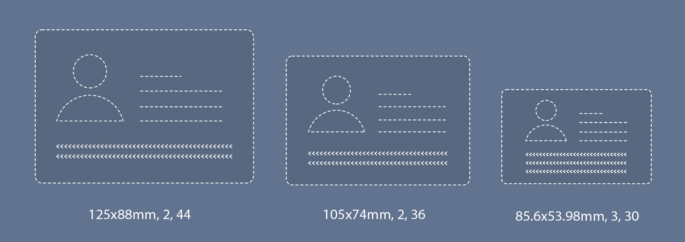
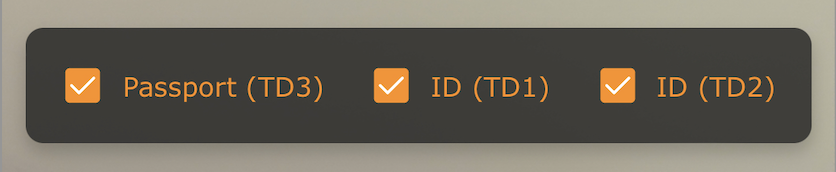

# User Guide for the MRZ Scanner JavaScript Edition

This user guide will walk you through a Hello World sample web application that scans MRZ documents using the MRZ Scanner JavaScript Edition SDK. We recommend using this sample as a reference when creating your own application.

## License

### Trial License

When getting started with MRZ Scanner, we recommend getting your own 30-day trial license through the following modal:



The trial license can be renewed via the [customer portal](https://www.dynamsoft.com/customer/license/trialLicense/?product=mrz&utm_source=guide&package=js) twice, each time for another 15 days, giving you a total of 60 days to develop your own application using the solution. Please contact the [Dynamsoft Support Team](https://www.dynamsoft.com/company/contact/) if you need more time for a full evaluation or have any questions.

> [!NOTE]
> The **MRZ Scanner** license contains a license for the **Dynamsoft Label Recognizer**, **Dynamsoft Code Parser**, and the **Dynamsoft Camera Enhancer** since the MRZ Scanner builds on top of those three products.

### Full License

If you are fully satisfied with the solution and would like to move forward with a full license, please contact the [Dynamsoft Sales Team](https://www.dynamsoft.com/company/contact/).

## Quick Start - Including the Library

> [!TIP]
> Please visit the [Introduction]({{ site.introduction }}index.html) page to learn about the MRZ document formats, the architecture of the MRZ Scanner with respect to other Dynamsoft products, and the system requirements of the MRZ Scanner JavaScript Edition.

The purpose of this guide is to help you implement a Hello World application using the MRZ Scanner solution. To showcase this, we will be using vanilla JS. You can find the full code in the [samples Github repo](https://github.com/Dynamsoft/mrz-scanner-javascript).

The first step before writing the code is to include the SDK in your application. You can simply include the SDK by using the precompiled script, but you can also build the SDK from source yourself.

<div class="multi-panel-switching-prefix"></div>

<div class="multi-panel-start"></div>
<div class="multi-panel-title">Use the Precompiled Script</div>

The simplest way to include the SDK is to use either the [**jsDelivr**](https://jsdelivr.com/) or [**UNPKG**](https://unpkg.com/) CDN. The Hello World sample that this guide will explore uses **jsDelivr**:

- jsDelivr

  ```html
  <script src="https://cdn.jsdelivr.net/npm/dynamsoft-mrz-scanner@3.0.0/dist/mrz-scanner.bundle.js"></script>
  ```

- UNPKG

  ```html
  <script src="https://unpkg.com/dynamsoft-mrz-scanner@3.0.0/dist/mrz-scanner.bundle.js"></script>
  ```

When using a framework such as **React**, **Vue** or **Angular**, we recommend adding the package as a dependency using a package manager such as **npm** or **yarn**:

  ```sh
  npm i dynamsoft-mrz-scanner@3.0.0 -E
  # or
  yarn add dynamsoft-mrz-scanner@3.0.0 -E
  ```

> [!WARNING]
> When using a package manager like **npm** or **yarn**, you likely need to specify the location of the engine files as a link to a CDN. Please see the [MRZScannerConfig API]({{ site.api }}mrz-scanner.html#mrzscannerconfig) for a code snippet on how to set the *engineResourcePaths*.

Below is the complete Hello World sample page that uses the precompiled script served via a CDN.

```html
<!DOCTYPE html>
<html lang="en">
  <head>
    <meta charset="utf-8" />
    <meta name="viewport" content="width=device-width, initial-scale=1.0" />
    <title>Dynamsoft MRZ Scanner - Hello World</title>
    <script src="https://cdn.jsdelivr.net/npm/dynamsoft-mrz-scanner@3.0.0/dist/mrz-scanner.bundle.js"></script>
  </head>

  <body>
    <h1 style="font-size: large">Dynamsoft MRZ Scanner</h1>

    <script>
      // Initialize the Dynamsoft MRZ Scanner
      const mrzScanner = new Dynamsoft.MRZScanner({
        license: "YOUR_LICENSE_KEY_HERE",
      });
      (async () => {
        // Launch the scanner and wait for the result
        const result = await mrzScanner.launch();
      })();
    </script>
  </body>
</html>
```

> [!NOTE]
>
> This code is a more simplified version of the Hello World file that is hosted on [Github](https://github.com/Dynamsoft/mrz-scanner-javascript/blob/main/samples/hello-world.html). 
> The file hosted on Github contains more code for a better final UI, but that extra code is not necessary to successfully launching the MRZ Scanner. All you need is the code shown above.
> Please do not forget to replace `YOUR_LICENSE_KEY_HERE` with your own license key, whether it is trial or full.

To run the sample, create a new file called `hello-world.html`, then copy and paste the code above into the file. Next, serve the page directly by deploying it to a server.

If you are using VS Code, a quick and easy way to serve the project is using the [Five Server VSCode extension](https://marketplace.visualstudio.com/items?itemName=yandeu.five-server). Simply install the extension, open the `hello-world.html` file in the editor, and click "Go Live" in the bottom right corner of the editor. This will serve the application at `http://127.0.0.1:5500/hello-world.html`.

Alternatively, you can use other methods like `IIS` or `Apache` to serve the project, though we will omit those methods here for brevity.

<div class="multi-panel-end"></div>

<div class="multi-panel-start"></div>
<div class="multi-panel-title">Build from Source</div>

While using the pre-compiled script is the easiest way to get started with the MRZ Scanner, we do also allow you to build the MRZ Scanner SDK from source. Building from source gives you the advantage of performing in-depth SDK customization.

The MRZ Scanner is built using three constituent Dynamsoft products: [**Dynamsoft Label Recognizer**]({{ site.dlr_js }}api-reference/label-recognizer-module.html?lang=javascript), [**Dynamsoft Code Parser**]({{ site.dcp_js }}api-reference/code-parser-module.html?lang=javascript), and [**Dynamsoft Camera Enhancer**]({{ site.dce_js }}api-reference/index.html?lang=javascript), so any MRZ Scanner customization involves working with the foundational API of these products.

The first step to building the SDK from source is retrieving the **MRZ Scanner JavaScript Edition** source files from the official [Github repository](https://github.com/Dynamsoft/mrz-scanner-javascript), compiling them into a distributable package, and then runs a *ready-made* Hello World sample page that is already included in the repo.

Follow these steps in order to build from the source:

1. Download the **MRZ Scanner JavaScript Edition** source files from [Github](https://github.com/Dynamsoft/mrz-scanner-javascript) as a compressed folder ("Download ZIP" option).

2. Extract the contents of the compressed folder.

3. Open the *Hello World* sample included with the source files located at `/samples/hello-world.html` (relative path to the decompressed directory) using your code editor of choice (like VS Code).

4. Search for 'YOUR_LICENSE_KEY_HERE' and replace that with your own license key, whether it is trial or full.

5. Install project dependencies - in the terminal, navigate to the project root directory and run the following:
    ```bash
    npm install
    ```

6. Build the project - once the dependencies are installed, build the project by running:
    ```bash
    npm run build
    ```

7. Serve the project via `localhost`:
    ```bash
    npm run serve
    ```
Once the server is running, open the application in a browser using the address provided in the terminal output from running `npm run serve`.

<div class="multi-panel-end"></div>

<div class="multi-panel-start"></div>
<div class="multi-panel-title">Self-hosting the Library Resources</div>

If you are looking to have a **completely offline setup**, we also provide the option to download the library's resource files, and then configuring them into your own server so that the users of your application would only need to connect to your server.

### Acquiring the Resource Files

The first step is to get a copy of the resources. There are two ways which you can do this:

- Go to the official [Github repository](https://github.com/Dynamsoft/mrz-scanner-javascript). Download the repository as a ZIP and the library resources are in the *dist* folder. So all you need is just a copy of this *dist* folder.

- If you are using `npm`, you could also install the package and extract the `dist` folder from the package in `node_modules`. Install the package using the command `npm i dynamsoft-mrz-scanner@3.0.0 -E`. Find the `dynamsoft-mrz-scanner` fodler in `node_modules` and the *dist* folder will be inside.

### Modify the Build Script

If you are working with a npm-dependent project (e.g. a *React* or *Angular* app), the build script in `package.json` needs to be modified to allow for the local source files to be copied over during the build process.

Update the `scripts` section in `package.json` to automatically copy the libraries during the build process:

```json
"scripts": {
    "serve": "node dev-server/index.js",
    "build": "rollup -c && npm run copy-libs",
    "copy-libs": "npx mkdirp dist/libs && npx cpx \"node_modules/dynamsoft-*/**/*\" dist/libs/ --dereference",
    "build:production": "rollup -c --environment BUILD:production"
},
```

### Update the Engine Resource Paths

By default, the engine resource paths of the libraries are usually set to the CDN links for each library. Once you modify the build script, the library resource files are then available locally so the engine resource paths can now be set to the path defined in the previous step.

```ts
const mrzScanner = new Dynamsoft.DocumentScanner({
    license: "YOUR_LICENSE_KEY_HERE",
    scannerViewConfig: {
        uiPath: "./dist/mrz-scanner.ui.html", // Use the local file
    },
    engineResourcePaths: {
        std: "./dist/libs/dynamsoft-capture-vision-std/dist/",
        dip: "./dist/libs/dynamsoft-image-processing/dist/",
        core: "./dist/libs/dynamsoft-core/dist/",
        license: "./dist/libs/dynamsoft-license/dist/",
        cvr: "./dist/libs/dynamsoft-capture-vision-router/dist/",
        dlr: "./dist/libs/dynamsoft-label-recognizer/dist/",
        dcp: "./dist/libs/dynamsoft-code-parser/dist/"
    },
});
```
> [!TIP]
> Please see [MRZScannerConfig API]({{ site.api }}mrz-scanner.html#mrzscannerconfig) for more info on the full configuration.

### Server Requirements for Deployment

Once you have the dist folder, the next step is to deploy it to a server of your choice. There are a couple of considerations to take into account when setting up the server:

#### Secure context (HTTPS deployment)

When deploying your application / website for production, make sure to serve it via a secure HTTPS connection. This is required for two reasons

- Access to the camera video stream is only granted in a security context. Most browsers impose this restriction.
> Some browsers like Chrome may grant the access for `http://127.0.0.1` and `http://localhost` or even for pages opened directly from the local disk (`file:///...`). This can be helpful for temporary development and test.

- Dynamsoft License requires a secure context to work.
    
#### Set the MIME type for `.wasm` as `application/wasm`
      
The goal is to configure your server to send the correct Content-Type header for the wasm file so that it is processed correctly by the browser.
  
Different types of webservers are configured differently, for example:

  + <a target="_blank" href="https://developer.mozilla.org/en-US/docs/Learn/Server-side/Apache_Configuration_htaccess#media_types_and_character_encodings" title="Apache">Apache</a>
  + <a target="_blank" href="https://docs.microsoft.com/en-us/iis/configuration/system.webserver/staticcontent/mimemap" title="IIS">IIS</a>
  + <a target="_blank" href="https://www.nginx.com/resources/wiki/start/topics/examples/full/#mime-types" title="NGINX">NGINX</a>

<div class="multi-panel-end"></div>

<div class="multi-panel-switching-end"></div>

## Breaking down Hello World

Let's now go through the code of the Hello World sample to understand how the code works in detail.

> [!NOTE]
> If you are using a framework like React/Angular/Vue, please refer to the [framework samples]({{ site.codegallery }}index.html#frameworks) built by the development team.

### Step 1: Setting up the HTML and Including the MRZ Scanner

```html
<!DOCTYPE html>
<html lang="en">
  <head>
    <meta charset="utf-8" />
    <meta name="viewport" content="width=device-width, initial-scale=1.0" />
    <title>Dynamsoft MRZ Scanner - Hello World</title>
    <script src="https://cdn.jsdelivr.net/npm/dynamsoft-mrz-scanner@3.0.0/dist/mrz-scanner.bundle.js"></script>
  </head>

  <body>
    <h1 style="font-size: large">Dynamsoft MRZ Scanner</h1>
  </body>

</html>
```

The first step in setting up the HTML in the Hello World project is to include the SDK. (We discussed the two available methods to include the SDK resources in the earlier [Quick Start](#quick-start---including-the-library) section) In this example, we include the precompiled MRZ Scanner SDK script via CDN in the header:

MRZ Scanner comes with a **Ready-to-Use UI**. When the MRZ Scanner launches, it creates a container which it populates with the **Ready-to-Use UI**.

### Step 2: Initializing the MRZ Scanner

```html
<body>
  <h1 style="font-size: large">Dynamsoft MRZ Scanner</h1>

  <script>
    // Initialize the Dynamsoft MRZ Scanner
    const mrzScanner = new Dynamsoft.MRZScanner({
      license: "YOUR_LICENSE_KEY_HERE",
    });
  </script>
</body>
```

Above is the **simplest** way to initialize the [**`MRZScanner`**]({{ site.api }}mrz-scanner.html#mrzscanner). Note the configuration object used to set the behaviour of the MRZ Scanner instance. The single property that is **required** to be defined in this configuration object is the **license key**. Without a valid license, the MRZ Scanner view fails to launch, and the user will be met with a license key error message. Please refer to the [licensing](#license) section of the guide for instructions on acquiring a license key.

### Step 3: Launching the MRZ Scanner

```html
<script>
  // Initialize the Dynamsoft MRZ Scanner
  const mrzScanner = new Dynamsoft.MRZScanner({
    license: "YOUR_LICENSE_KEY_HERE",
  });
  (async () => {
    // Launch the scanner and wait for the result
    const result = await mrzScanner.launch();
    console.log(result);
  })();
</script>
```

Now that the [**`MRZScanner`**]({{ site.api }}mrz-scanner.html#mrzscanner) has been initialized and configured, it is ready to be launched! Upon launch, the MRZ Scanner presents the main **`MRZScannerView`** UI in its container on the page, and is ready to start scanning. Upon scanning an MRZ (via video or static image), the MRZ Scanner then switches to the **`MRZResultView`**, which displays a cropped image of the MRZ document as well as the parsed fields of the MRZ text. Let's break down these two Views:

#### `MRZScannerView`

The `MRZScannerView` is configured using [**`MRZScannerViewConfig`**]({{ site.api }}mrz-scanner.html#mrzscannerviewconfig), which is composed of the following UI elements:

1. **Camera View**: The Camera View is the camera viewfinder UI component within the `MRZScannerView`. This viewfinder occupies the majority of the space within the MRZScannerView to give the user a clear view and precise control of the image being scanned.

2. **Scan Guide Frame**: The Scan Guide Frame is an overlay placed on top of the Camera View that guides the user to place the MRZ document in the middle of the Camera View, in order to achieve a fast and accurate scan. The guide frame is enabled **by default**, but may be hidden via the [**`MRZScannerViewConfig`**]({{ site.api }}mrz-scanner.html#mrzscannerviewconfig) interface. Note that if scan guide frame is enabled, the scanner also crops out the region outside the guide frame.

    <div align="center">
       
    </div><br />

3. **Format Selector**: Below the scan guide frame, you will also notice a selector box that allows the user to choose which formats the MRZ Scanner should recognize. The formats that show up in the format selector are configurable via the [**`MRZScannerConfig`**]({{ site.api }}mrz-scanner.html#mrzscannerconfig) interface, while the visibility of the format selector itself is configurable via the [**`MRZScannerViewConfig`**]({{ site.api }}mrz-scanner.html#mrzscannerviewconfig) interface. To learn about MRZ formats, please refer to the [Introduction]({{ site.introduction }}index.html#supported-mrz-formats) page.

    <div align="center">
       
    </div><br />

4. **Resolution/Camera Select Dropdown**: This dropdown allows the user to switch cameras (should they have more than one available on the device), or select a different resolution for the camera that is currently selected.

5. **Load Image Button**: This button allows the user to scan a file of an image that contains a MRZ from the device's local storage.

6. **Sound Button**: When toggled on, the MRZ Scanner plays a *beep* sound to signal when the scanner recognizes an MRZ.

7. **Flash Button**: This button is responsible for toggling the flash of the camera (when one is available). The flash button does not appear if the device does not have a camera flash, or the browser does not support camera flash.

8. **Close Scanner Button**: This button closes the MRZ Scanner and takes the user back to the landing page.

> [!NOTE]
> To learn more on how to customize the MRZScannerView and its corresponding UI elements, we recommend reading the [Customizaton Guide]({{ site.guides }}mrz-scanner-customization.html) as that will shed a lot more light on how to customize the scanner UI to fit your needs.

#### `MRZResultView`

Here is a quick breakdown of the constituent UI elements of the result view, controlled by [**`MRZResultViewConfig`**]({{ site.api }}mrz-scanner.html#mrzresultviewconfig):

1. **Original Image**: A cropped image of the scanned MRZ document - this gets displayed at the top of the `MRZResultView` by default.

2. **Parsed Results**: The data parsed from the MRZ code, displayed with their corresponding field names (e.g. Given Name, Nationality, etc.) are placed below the cropped image of the MRZ corresponding field names. In addition to displaying these parsed results, the MRZ Scanner allows the user to edit the values of the fields in case of any errors by cross referencing from the cropped MRZ document displayed directly above.

3. **Re-take Button**: This button discards the previous scan and parsed data, then takes the user back to the **`MRZScannerView`** to scan another MRZ document.

4. **Done Button**: This button closes the scanner and destroys the **`MRZScanner`** instance, and returns the result object containing the MRZ scan. At that point, the application goes back to the landing page. You can additionally dictate further actions upon the button click, such as allowing the user to perform some extra actions with the MRZ result, navigating to another page, passing the result object for further processing, and more.

5. **Cancel Button**: When the scanner is launched with a static file instead of using the default camera UI, this button will appear in the result view in place of the re-take button. Once this button is clicked, the MRZ result is discarded and the user returns to the landing page. You can dictate the action(s) that happen once the button is clicked using the `onCancel` callback function of the [`MRZResultViewConfig`]({{ site.api }}mrz-scanner.html#mrzresultviewconfig) in case you do not want the user to go back to the same landing page they were on. 

  > [!NOTE]
  >  In the Hello World sample, no action is taken once the Done button is clicked. The scanner closes and the user is met with an empty page. In order to open the scanner again, the user must refresh the page. You may choose to implement a more user-friendly behavior in a production environment, such as presenting the user with an option to re-open the MRZ Scanner upon closing it.

## Next Steps

Now that you got the most basic functionality of the MRZ Scanner up and running, it's time to explore the many ways in which the MRZ Scanner can be used, including customization and the ability to read directly from static images and PDFs. To learn more about those two topics, please visit the following articles

- [Customizing the MRZ Scanner]({{ site.guides }}mrz-scanner-customization.html)
- [Setting up the MRZ Scanner for Static Images and PDFs]({{ site.guides }}mrz-scanner-static-image.html) 