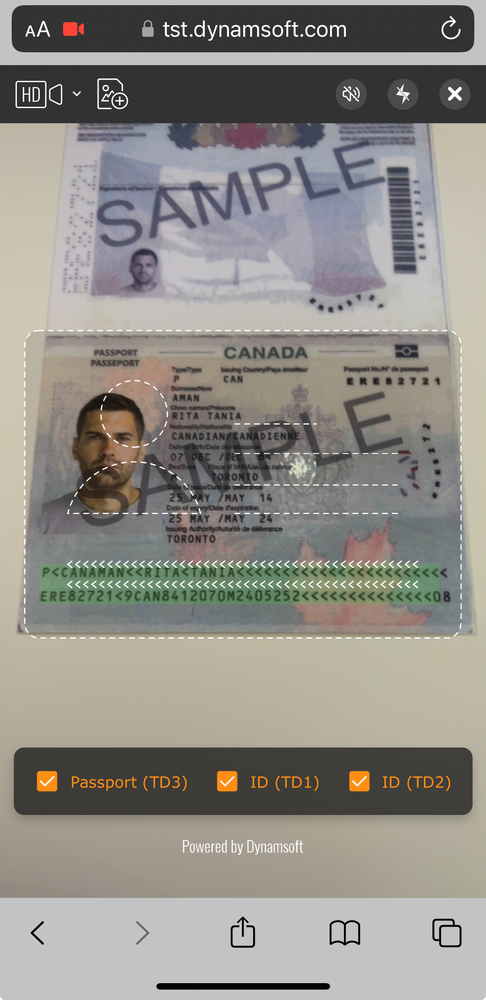
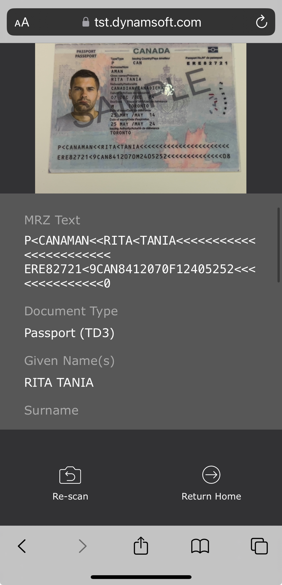

# Introduction

In today's world of constant travel and activities that require identity verification, it is important to have the tools necessary in order to quickly and accurately capture and recognize all of that personal information in one go. Most travel and identity documents today come with a *Machine Readable Zone* (MRZ for short) that stores and encrypts all of the information of that identity document in just a few lines.

When it comes to reading MRZ documents, it is important to find a library that not only recognizes the MRZ lines, but also then parses them into human readable fields for the user. With the **MRZ Scanner JavaScript Edition**, there is no better library to help you achieve that for any kind of web application you are building, all with just a few lines of code!

## Core Products

The MRZ Scanner JavaScript Edition relies on three of Dynamsoft's core products:

1. [**Dynamsoft Label Recognizer**]({{ site.dcvb_root }}introduction/index.html#dynamsoft-label-recognizer) - A zonal OCR library that is responsible for the text extraction portion of the MRZ scanning workflow.

2. [**Dynamsoft Code Parser**]({{ site.dcvb_root }}introduction/index.html#dynamsoft-code-parser) - The library designed for parsing encrypted results from the *Barcode Reader* or *Label Recognizer* into human-readable information.

3. [**Dynamsoft Camera Enhancer**]({{ site.dcvb_root }}introduction/index.html#dynamsoft-camera-enhancer) - The library that is responsible for all camera control features, in addition to camera enhancements and basic UI configuration features.

## Common Usage Scenarios

1. **Passports** - Passports are the most popular type of identity document that utilizes MRZ. **MRZ Scanner JavaScript Edition** can help enhance the user experience for any application in the travel or aerospace field where passports are typically used.

2. **ID Cards** - ID cards are another common type of identity document that makes use of MRZ. With the **MRZ Scanner JavaScript Edition**, scanning ID cards and extracting all of the information from it has never been easier.

## Supported MRZ Formats

The Machine Readable Travel Documents (MRTD) standard specified by the International Civil Aviation Organization (ICAO) defines how to encode information for optical character recognition on official travel documents.

The **MRZ Scanner JavaScript Edition** supports three types of MRTD, which encompass the majority of the MRZ documents that are used in various fields around the world. Here they are in order of popularity:

### Passport (TD3)

The MRZ of passports conform to the **TD3** format - which consists of **2 lines, 44 characters each**. Below is a sample of a TD3 MRZ from a sample passport to give you an idea of what it looks like:

   

### ID (TD1)

The majority of ID cards conform to the **TD1** format - which consists of **3 lines, 30 characters each**. Below is a sample of a TD1 MRZ from a sample ID to give you an idea of what it looks like:

   

### ID (TD2)

In some more rare cases, an ID card can have a MRZ that conforms to the **TD2** format - which consists of **2 lines, 36 characters each**. Below is a sample of a TD2 MRZ from a sample idea to give you an idea of what it looks like:

   

## Design Principles

We designed the **MRZ Scanner JavaScript Edition** with three core principles in mind:

1. **Minimal Code** - High-level API provide full recognition and parsing functionality with **just a few lines of code**, significantly reducing development and maintenance costs.
2. **Ready-To-Use UI** - Pre-integrated components and a pre-designed UI simplify the process even more for any developer, enabling a **quick setup and saving any time and effort needed for the UI design**.
3. **Effortless Customization** - Tailored configuration interfaces allow for **quick and simple customization** of the scanner settings and performance.

We will now introduce the two views that make up the core of the MRZ Scanner to offer a clearer idea of the design before you begin development on your own application.

### Views

The **MRZ Scanner JavaScript Edition** is reliant on two core views, the **`MRZScannerView`** and the **`MRZResultView`**.

#### `MRZScannerView`

The **`MRZScannerView`** is the main view of the solution which displays the camera view, along with some UI elements that control the scanner and camera settings, along with icons to allow the user to load in a photo from the photo library as well as close the scanner. This view comes with a scan guide frame in the center to better guide the user on where to place the MRZ document for best results.

Here is a quick screenshot at default look of the **`MRZScannerView`**:

   

#### `MRZResultView`

The **`MRZResultView`** is responsible for displaying the final parsed results of the MRZ recognition process. The final parsed results, along with their corresponding field names, appear as a scrollable form view underneath the original image of the MRZ document.

Included with those two things are two buttons, one that allows the user to scan again if needed, and the other to wrap up the scanning process and proceed to the next step (like navigating to another page).

Here is a quick screenshot at the default look of the **`MRZResultView`**:

   

## System Requirements

### Secure Context (HTTPS Deployment)

When deploying your web application for production, ensure it is served over a **secure HTTPS connection**. This is required for the following reasons:

1. **Browser Security Restrictions** – Most browsers only allow access to camera video streams in a secure context.
    > Some browsers like Chrome may grant access to camera video streams for `http://127.0.0.1`, `http://localhost`, or even pages opened directly from the local file system (`file:///...`). This can be helpful during development and testing.

2. **Dynamsoft License Requirements** – A secure context is required for **Dynamsoft licenses** to function properly.

### Required Browser Features

The following** browser features** are required for the **DCE** and **DDN** components of **DDS** and **MWC**:

1. [`WebAssembly`](https://caniuse.com/?search=WebAssembly)
2. [`Blob`](https://caniuse.com/?search=Blob)
3. [`URL`](https://caniuse.com/?search=URL)/[`createObjectURL`](https://caniuse.com/?search=createObjectURL)
4. [`Web Workers`](https://caniuse.com/?search=Worker)

### Supported Browsers

The table below lists the **minimum supported versions** of browsers based on these requirements:

| Browser | Version |
| :-----: | :-----: |
| Chrome  |  v78+   |
| Firefox |  v79+   |
| Safari  |  v15+   |
|  Edge   |  v92+   |

1 iOS 14.3+ is required for camera video streaming in Chrome and Firefox or Apps using webviews.

## Live Demo

For the best demonstration of the full capabilities of the MRZ Scanner JavaScript Edition, please visit the [official Dynamsoft MRZ Scanner JavaScript demo](https://demo.dynamsoft.com/mrz-scanner/).

## Next Steps

If you are looking to create your own MRZ scanning application for browsers, then the **MRZ Scanner JavaScript Edition** is the solution for you! To get started with the development, please refer to the [**User Guide**]({{ site.guides }}mrz-scanner.html) that will walk you through the steps to get a *Hello World* implementation going as well as the different ways you can customize the **MRZ Scanner**.
